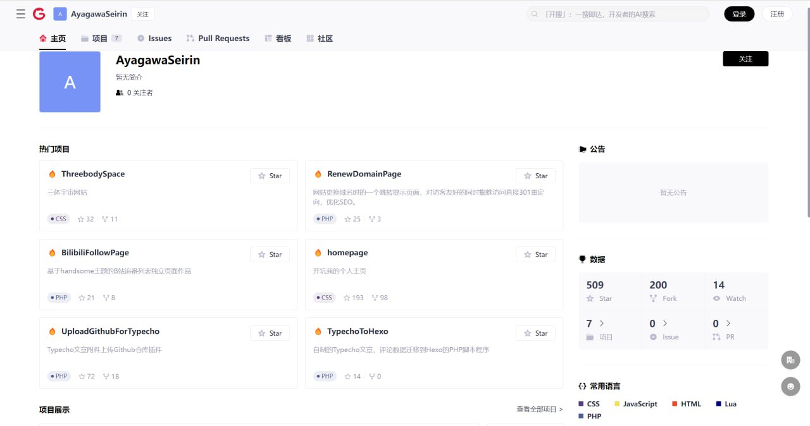
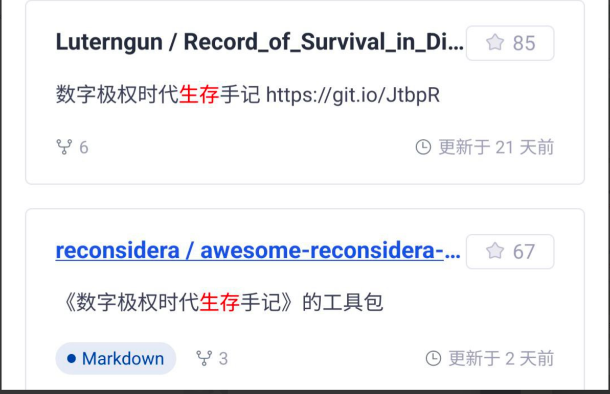

Notice: Use this tool carefully if you understand what you do.
Notice: Use this tool carefully if you understand what you do.
Notice: Use this tool carefully if you understand what you do.

## Why?

Recently, CSDN(CSDN = Copy, Steal and pay-Download Net)'s product gitcode.com do the suck things.
Unbelievable, CSDN has done it again—they've created a so-called open source code sharing platform called gitcode.com.
They've practically migrated all the repositories from GitHub over there, even going so far as to bulk replace GitHub
links in READMEs with gitcode links.

Just to check, I searched for my ID on gitcode and found that small projects I wrote five years ago were directly copied
over, despite the fact that I don't even have an account on their platform.

So，I write this tiny tool to poison some baned words to repo to prevent from being stolen




## How?

Add some baned words in china, if some suck company in china try to steal
your repository with crawler, when they meet baned words they will skip for scrapy your repo.

## Use?

Download the repo release and chmod execute permission(Linux/Mac)

### poison your repo with append baned words to LICENSE file

```bash
> poison-csdn -h
Add baned words in a new license file.

Usage:
  poison-csdn license [flags]

Flags:
  -g, --git           enable git commit or not
  -h, --help          help for license
  -p, --path string   path of repository (default ".")
  -w, --word string   custom baned words (default " ")

eg:
poison-csdn license -p path-to-your-git-repo


```

### poison your repo with append baned words to README.md file

```bash
> poison-csdn -h
Add baned words in markdown file.

Usage:
  poison-csdn markdown [flags]

Flags:
  -g, --git           enable git commit or not
  -h, --help          help for markdown
  -p, --path string   path of repository (default ".")
  -w, --word string   custom baned words (default " ")


eg：
poison-csdn markdown -p path-to-your-git-repo -w fuck csdn

```

### poison your repo with append baned words to custom tem file

```bash
> poison-csdn -h

Add baned words in a temp file.

Usage:
  poison-csdn tempfile [flags]

Flags:
  -f, --file string   custom tempfile for baned words (default "tempfile.txt")
  -g, --git           enable git commit or not
  -h, --help          help for tempfile
  -p, --path string   path of repository (default ".")
  -w, --word string   custom baned words (default " ")

eg:
poison-csdn tempfile -p path-to-your-git-repo -w fuck csdn -f fuck-csdn.txt 


```

<details>
<summary>Anti For Repo Stolen</summary>
########Anti CSDN Stolen Repo With Baned Words########

CSDN has unauthorizedly created accounts on their GitCode platform for GitHub users
and cloned repositories from their accounts without permission. We strongly protest and boycott such rogue behavior.
As a response, we should include banned keywords in our repository files - 20240626 Fireinrain.

fuck csdn
######Anti CSDN Stolen Repo With Baned Words End######
</details>
